# What is TypeScript ?

    -   TypeScript is like a more powerful verison of js.It lets you do everything that Js does , but it adds some extra feature to make your life easier when writing larger and complex programs  

## Where dowanload Ts ?

    -   Ts offical website : [https://www.typescriptlang.org/]
    -   we gonne need node js , to download it :[https://nodejs.org/en]
    -   after download it  , run this cmd : node -v  , to see the version fo your node 

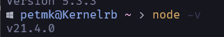

    -   Globally Installing TypeScript : npm install -g typescript 
    -   TypeScript in Your Project : npm install typescript --save-dev
    -   after  doint the previous , now run  : tsc -v , u can see the version of ur ts 

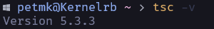

## Setup your ide : 

    -  For me , I'm using  Vs code  but u can use whatever u want like neovim ... 
    -  In vs , we gonna need this extention 

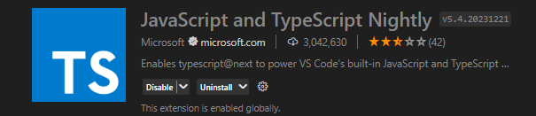 

    and also an other extention called Code Runner 

## First Ts file  :

    -  We gonna create a file called "index.ts" , ts is typescript extention
    -  U gonna find all codes on the github repo with documentation 
    
# Annotations : 

    - Annotation are used to specify the data type of a variable , parametre , function return value , and other types of values . 

## What is the perpous of Annotation: 

    - Annotation helps devlopers to catch errors early in devlopement by allowing theme to specify what type of values can be assigned to a given varibale or passed an argument to a fucntion 

### Example of Annotation : 

    - Annotation in ts : ``ts
        let myValue: type = value
    ``
    - Correct Annotation : 

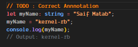

    - Incorrect Annotation :

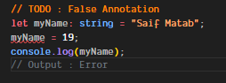

#### String : 

    - let myStr: string  = "String" ;

#### Number : 

    - let myAge : Number  = 7 ;

#### Boolean 

    - let tsHard : boolean  = false ;

 u Can find all does examples on this path 

 [Code/Annotation.ts]

# TypeInference :   

    - If you declare a variable without explicity specifying its type , TypeScript will try to infer the type based on the value you assign to it .

## Example : 

# Any Type in Ts  :

    - In TypeScript, any means a variable can be anything, bypassing the usual type checks. It's flexible but risky. 

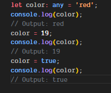

# Function { Parameters : Annotations} : 

    - In ts are used to specify the expected types of the parametres that a function takes

## Example : 

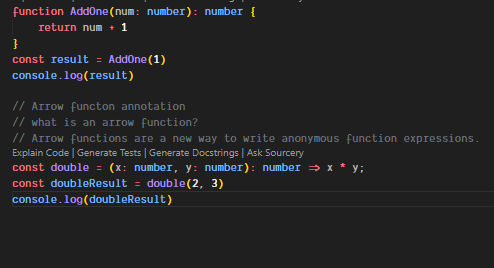

## Return Annotation (Regular) :

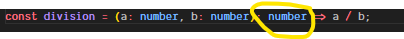

# Void in TypeScript : 

## What is Void : 

    -  is like a function that does a job but doesn't produce a result you can use,is like saying, "I'm doing something, but I won't give you anything in return.

### Example : 

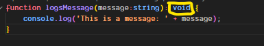

# Never in Typescript : 

    - The never keyword is used to indicate that a function will not return anything , or that a varibale will never have a value . the never type is useful for indicating that certain code path should never be reached . it can help catch errors at compile time instead of run time.
    -"never" is like a special type we use when we want to tell TypeScript, "This thing will never happen or finish normally."

    - Never : 
        - A fnct that always throws an error 
        - A fnct that has an ifinite loop
        - A variable that can nvr have a value

# Arrays in TypeScript 

    - Arrays are a type of obeject that can store multiple values of the same data type .
    - Arrays in ts are typed , meaning that you can specify what type of values can be stored in an array .
    - There are two ways to declare an array type :
        - let myArr : type[] = [] ;
        - let myArr : Array<type> = [] ;
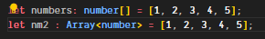
    - push() : 
        - The push() method adds one or more elements to the end of an array and returns the new length of the array.
    - pop() :
        - The pop() method removes the last element from an array and returns that element. This method changes the length of the array.

# Multi-dimensional Arrays in TypeScript : 

    - A multi-dimensional array is an array that contains another array(s) as its element(s). 
    - The elements of a multi-dimensional array are arranged in a tree-like structure, where each element of the main array is a sub-array.
    - The main array contains three elements. Each element is a sub-array. The first sub-array contains three elements, the second sub-array contains two elements, and the third sub-array contains four elements.
example :
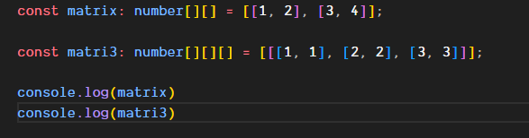

# Objects in Typescript :
    - Objects are a type of data in Typescript that can store a collection of data .
    - Objects in ts are typed , meaning that you can specify what type of values can be stored in an object .
example :
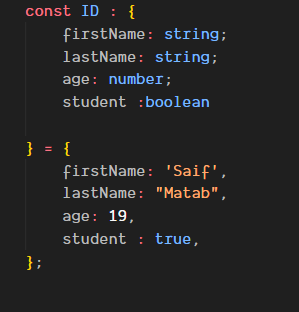

# Type Aliases : 
        - A type in Typescript is a way to describe a value . like : string , number , boolean , etc ...
        - Type aliases are a way to create a new name for a type in Typescript.
        - Type aliases are defined using the type keyword , followed by the name of the type , an equal sign , and the type that the alias refers to .
example :
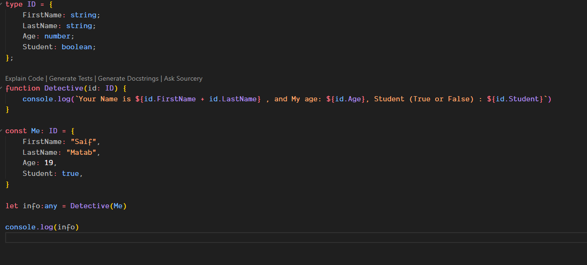

# Optional Properties in TypeScript : 

    - Optional properties are properties that may or may not exist on an object. 
    - Optional properties are declared using a question mark (?) after the property name.
    - Optional properties are useful when you want to allow for the possibility of a property not existing on an object.
example :
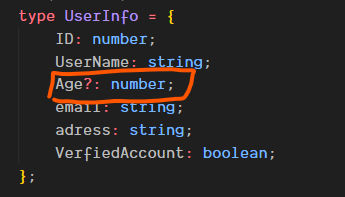
